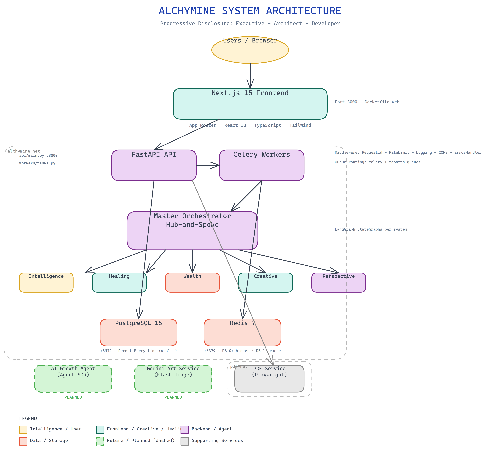
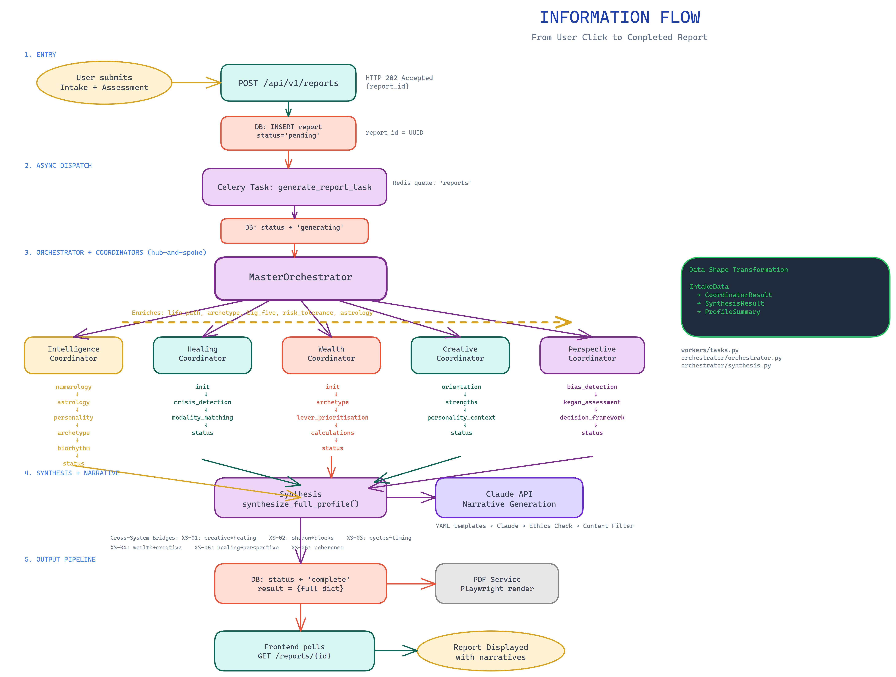
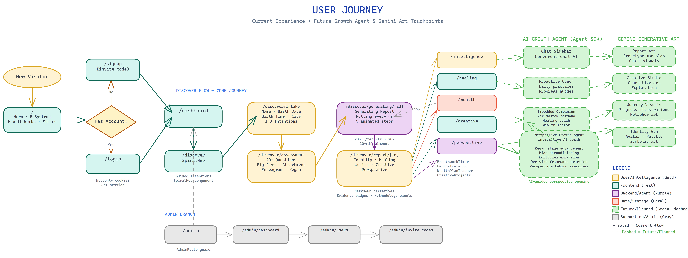
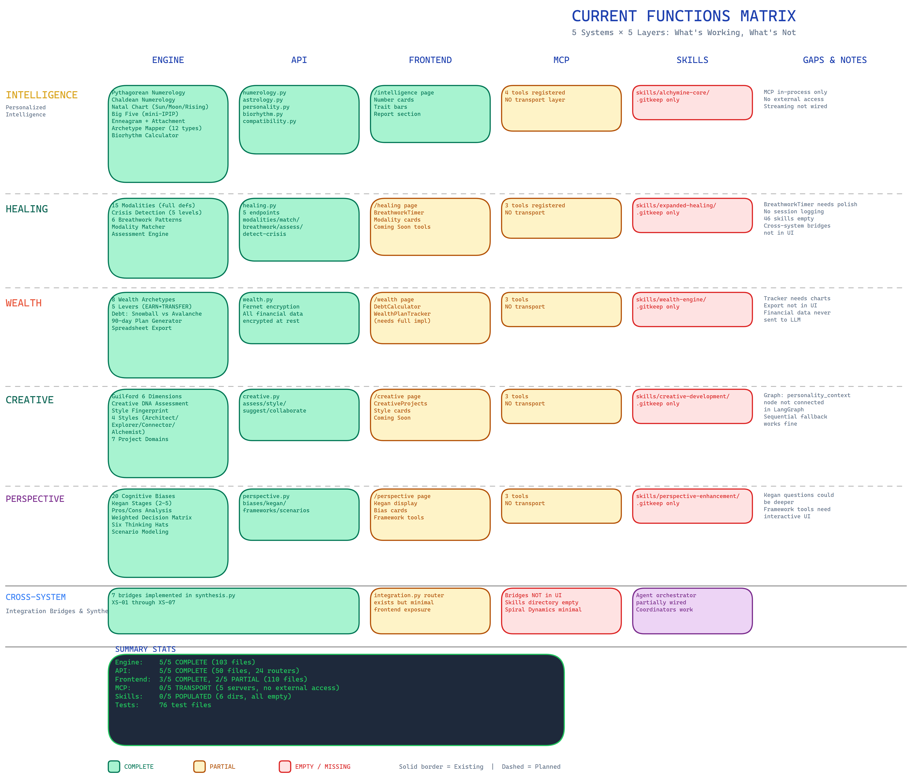
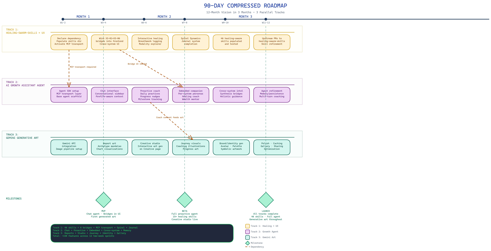

# Alchymine

**Open-Source AI-Powered Personal Transformation Operating System**

_"Turn knowing into gold."_

Personalized Intelligence | Ethical Healing | Generational Wealth | Creative Development | Perspective Enhancement

---

## What is Alchymine?

Alchymine is a five-system platform that transforms self-knowledge into actionable life strategy:

1. **Alchymine Core** -- Deep self-discovery through numerology, astrology, archetypes, and personality science
2. **Healing Swarm** -- Ethical holistic practices: breathwork, meditation, and 15+ evidence-grounded healing modalities
3. **Wealth Engine** -- Actionable wealth-building across 6 domains: income, investment, business, defense, family, and intelligence
4. **Creative Forge** -- 7-domain creative development grounded in the neuroscience of DMN-ECN coupling
5. **Perspective Prism** -- 3-layer perspective enhancement: cognitive reframing (CBT), strategic positioning, worldview expansion

Built on [healing-swarm-skills](https://github.com/realsammyt/healing-swarm-skills). Licensed under CC-BY-NC-SA 4.0.

## Quick Start

```bash
# Clone the repository
git clone https://github.com/realsammyt/Alchymine.git
cd Alchymine

# Start the full development stack
docker compose -f infrastructure/docker-compose.yml \
               -f infrastructure/docker-compose.dev.yml up

# Access the application
# Web: http://localhost:3000
# API: http://localhost:8000
# API docs: http://localhost:8000/docs
```

### Manual Setup

```bash
# Python engine + API
pip install -e ".[dev]"
uvicorn alchymine.api.main:app --reload --port 8000

# Frontend
cd alchymine/web && npm install && npm run dev
```

## Architecture

Alchymine uses a hub-and-spoke agent architecture: 1 Master Orchestrator dispatches to 5 System Coordinators, each running LangGraph state graphs with domain-specific agents.

### System Overview



<details>
<summary><strong>Information Flow — Request Lifecycle</strong></summary>



User intake → FastAPI → Celery worker → Master Orchestrator → 5 coordinators (Intelligence enriches all downstream systems) → Synthesis → Claude API narratives → Quality gates → Report + PDF.

</details>

<details>
<summary><strong>User Journey</strong></summary>



Landing → Auth → Intake → Assessment → Report Generation → Report View → System Exploration. Future: AI Growth Assistant Agent with per-system coaching, and Gemini-powered generative art throughout.

</details>

<details>
<summary><strong>Current Functions Matrix</strong></summary>



**Status:** Engines 5/5 complete, APIs 5/5 complete, Frontend 3/5 complete, MCP 0/5 transport, Skills 0/5 populated.

</details>

### Roadmap — 90-Day Compressed



Three parallel tracks over 12 two-week sprints:

1. **Healing-Swarm-Skills + Cross-System UX** — Activate 46 skills, wire cross-system bridges into frontend, interactive healing tools
2. **AI Growth Assistant Agent** (Claude Agent SDK) — Chat interface → Proactive coach → Embedded per-system companion
3. **Gemini Generative Art** — Report visuals → Creative studio → Journey illustrations → Personal brand/identity generation

**Milestones:** Week 4 MVP · Week 8 Beta · Week 12 Launch

**Key numbers:**

- **34 agents** across 5 systems (28 domain + 5 coordinators + 1 orchestrator)
- **19 quality gates** for ethical, accurate, culturally sensitive outputs
- **15 healing modalities** with evidence ratings and crisis detection
- **All financial math is deterministic** — never LLM-generated, always encrypted
- **Open diagrams:** All `.excalidraw` files in `docs/diagrams/` — open at [excalidraw.com](https://excalidraw.com)

## Tech Stack

| Layer      | Technology                                                          |
| ---------- | ------------------------------------------------------------------- |
| Engine     | Python 3.11+ (numerology, astrology, wealth, creative, perspective) |
| API        | FastAPI + Celery + Redis                                            |
| Frontend   | Next.js 15+ (App Router), React, TypeScript, Tailwind CSS           |
| Database   | PostgreSQL 15+                                                      |
| Agents     | CrewAI + LangGraph + MCP                                            |
| LLM        | Claude API (recommended) + Ollama fallback                          |
| PDF        | Puppeteer/Playwright                                                |
| Deployment | Docker Compose → DigitalOcean                                       |

## Development

See [CONTRIBUTING.md](CONTRIBUTING.md) for the full guide.

```bash
# Run Python tests
pytest tests/engine/ tests/api/ -v

# Run frontend tests
cd alchymine/web && npm test

# Lint
ruff check alchymine/
cd alchymine/web && npm run lint

# Type check
mypy alchymine/
cd alchymine/web && npm run type-check
```

## Deployment

Alchymine uses a **zero-downtime** release pipeline with automatic rollback:

```
Merge PR to main → Draft release auto-created → Review & publish → Zero-downtime deploy
```

### How it works

1. **Merge to `main`** — CI runs (lint, test, build). If green, the `prepare-release` workflow auto-detects version bump from commit messages and creates a **draft GitHub Release**
2. **Review the draft** — Go to GitHub Releases, review the changelog and version
3. **Publish the release** — Click "Publish release" to trigger the deployment pipeline
4. **Zero-downtime deploy** — All 4 Docker images (api, web, worker, pdf) are built and pushed to GHCR, then the deploy script:
   - Pulls pre-built images on the droplet (old version still serving)
   - Starts temporary containers and health-checks them
   - Swaps nginx to the new containers via graceful reload
   - Recreates the compose stack, then swaps nginx back
   - If any health check fails, the old version keeps serving automatically

### Rollback

If a deploy goes wrong, use the **Diagnose** workflow (`Actions → Diagnose → rollback`) to redeploy the previous version. The deploy script tracks `.deployed-version` and `.previous-version` on the droplet.

### Required GitHub Secrets

Set these in **GitHub → Settings → Secrets and variables → Actions**:

| Secret                  | Value                                              |
| ----------------------- | -------------------------------------------------- |
| `DEPLOY_HOST`           | DigitalOcean droplet IP address                    |
| `DEPLOY_USER`           | `alchymine` (deploy user)                          |
| `DEPLOY_SSH_KEY`        | Private SSH key (full PEM content)                 |
| `DEPLOY_SSH_PASSPHRASE` | Passphrase for the SSH key (if password-protected) |

### Manual deployment

```bash
ssh alchymine@your-server-ip
cd ~/Alchymine
# Deploy a specific version (images must exist in GHCR)
infrastructure/scripts/deploy-zero-downtime.sh <version>
```

See [docs/guides/deployment-guide.md](docs/guides/deployment-guide.md) for the full deployment guide.

## Project Tracking

Development is tracked through GitHub Issues with 8 milestones across 60 weeks:

| Phase | Focus                                 | Weeks  |
| ----- | ------------------------------------- | ------ |
| 1     | Insight Foundation                    | 1--4   |
| 2     | Healing + Wealth Archetype            | 5--8   |
| 3     | Wealth Engine Core                    | 9--14  |
| 4     | Family & Ecosystem                    | 15--20 |
| 5     | Expanded Healing Modalities           | 21--28 |
| 6     | Global & Ecosystem Maturity           | 29--36 |
| 7     | Creative Forge Launch                 | 37--48 |
| 8     | Perspective Prism + Alchemical Spiral | 49--60 |

## Ethics

Alchymine operates under a unified ethical framework:

- **Do No Harm**: No health claims, no financial guarantees, mandatory disclaimers
- **Honor Traditions**: Proper attribution of all cultural and spiritual lineages
- **Evidence + Humility**: Evidence ratings on every framework, transparent methodology
- **Empower, Not Control**: User autonomy, no dark patterns, no fake scarcity
- **Privacy as Sanctuary**: Local-first data, AES-256 encryption, zero telemetry
- **Accessible to All**: WCAG 2.1 AA, screen reader support, plain-language financial glossary
- **Continuous Improvement**: Skill versioning, community contributions, outcome measurement

## License

CC-BY-NC-SA 4.0. See [LICENSE](LICENSE).

For commercial licensing: tyler@tylersammy.com
